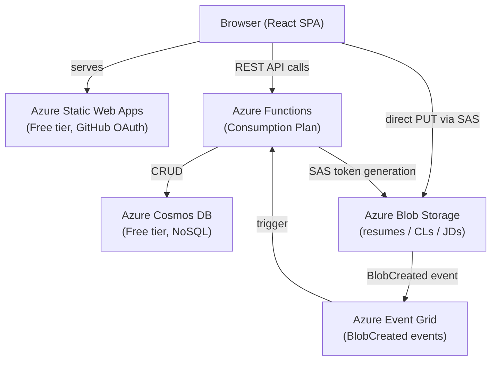

# Phase 6 Plan — Polish & Showcase-Ready

**Date:** 2026-03-24
**Phase:** 6 — Polish & Showcase-Ready
**Estimated effort:** 8–10 hrs

---

## Goal

Make the app genuinely showcase-ready: polished UX, no deferred defects, documented for a technical audience, and security-verified. The output should stand on its own as a portfolio artifact that demonstrates full-stack Azure skills.

---

## Scope

**In scope:**

- Activity/event log timeline per application (new backend + frontend feature)
- Drag-and-drop interview reorder (deferred from Phase 4, M-1)
- Security review (CORS, SAS tokens, auth coverage)
- README for the repository root (portfolio-facing documentation)
- Key test coverage gaps (T-1, T-2, T-5, T-7 from Phase 4 review)
- Final UI edge case fixes

**Out of scope:**

- v2 AI features (R7, R8)
- Custom domain setup
- Infrastructure topology changes
- Schema-breaking API changes

---

## Current Baseline

- Both CI/CD workflows live and passing
- All 16 API endpoints deployed and smoke-tested
- Frontend complete with 35 tests
- Route conflict bug fixed post-deploy
- No `history` field in Application document — activity log is net-new

---

## Workstream A — Security Review

**Effort: ~1.5 hrs | Do this first — any findings may affect other workstreams**

### A1. Auth coverage audit

Verify every Function in `api/src/functions/` calls `requireOwner(req)` as its first operation and returns early on failure. Check all 16 functions:

- createApplication, getApplication, listApplications, updateApplication
- deleteApplication, restoreApplication, listDeleted, getStats
- addInterview, updateInterview, deleteInterview, reorderInterviews
- uploadSasToken, downloadSasToken, deleteFile, processUpload*

*`processUpload` is triggered by Event Grid (not HTTP) — it has no `x-ms-client-principal` header. Confirm that the Event Grid subscription is the only way to trigger it (no exposed HTTP route).

### A2. SAS token verification

Confirm in `uploadSasToken` and `downloadSasToken`:

- Upload token: create+write only (`cw`), single blob scope, 5-minute expiry
- Download token: read only (`r`), single blob scope, 5-minute expiry
- Tokens use `StorageSharedKeyCredential` (account key), not a user delegation key

### A3. CORS verification (deployed vs Bicep)

Confirm the deployed Storage account CORS matches the Bicep definition:

```bash
az storage cors list --account-name stjobtrackermliokt --services b
```

Expected: SWA origin only (`https://gray-rock-0c358e300.1.azurestaticapps.net`), methods PUT/GET/HEAD, no wildcard origins.

Also confirm Function App CORS in Azure Portal includes the SWA hostname.

### A4. Input validation completeness

Spot-check that `processUpload` rejects:

- Blobs > 10 MB (size check before Cosmos write)
- Files that fail magic byte validation (PDF/DOCX/HTML)
- Applications that are soft-deleted (`isDeleted: true`)

### A5. Document findings

Create `docs/reviews/phase-6-security-review.md` with results. If any issues found, fix before proceeding to other workstreams.

---

## Workstream B — Activity Log (New Feature)

**Effort: ~2.5 hrs**

### Overview

Add a timeline of key events per application — status changes, file uploads, interview additions, deletions, restores. Displayed in the Application Detail page as a vertical timeline component.

### B1. Define the data model

Add `history` array to the Application Cosmos document:

```typescript
export interface ActivityEvent {
  id: string;          // UUID
  type: ActivityEventType;
  timestamp: string;   // ISO 8601
  description: string; // Human-readable summary, e.g. "Status changed to Interview Stage"
}

export type ActivityEventType =
  | "application_created"
  | "status_changed"
  | "interview_added"
  | "interview_updated"
  | "interview_deleted"
  | "file_uploaded"
  | "file_deleted"
  | "application_deleted"
  | "application_restored";
```

Add `history: ActivityEvent[]` to the `Application` type in `api/src/shared/types.ts` and `client/src/types/index.ts`. Default: `[]`.

### B2. Backend — append history entries on mutations

In each relevant endpoint, append a new `ActivityEvent` before the Cosmos upsert:

| Endpoint | Event type | Description template |
|----------|-----------|----------------------|
| `createApplication` | `application_created` | "Application created" |
| `updateApplication` (status changed) | `status_changed` | "Status changed to {newStatus}" |
| `updateApplication` (other fields) | _(no event — field edits are not logged)_ | — |
| `addInterview` | `interview_added` | "Interview added: {type} (Round {round})" |
| `updateInterview` | `interview_updated` | "Interview updated: {type} (Round {round})" |
| `deleteInterview` | `interview_deleted` | "Interview removed: {type} (Round {round})" |
| `processUpload` | `file_uploaded` | "File uploaded: {fileName} ({fileType})" |
| `deleteFile` | `file_deleted` | "File deleted: {fileType}" |
| `deleteApplication` | `application_deleted` | "Application soft-deleted" |
| `restoreApplication` | `application_restored` | "Application restored" |

Implementation pattern for each endpoint:

```typescript
const newEvent: ActivityEvent = {
  id: crypto.randomUUID(),
  type: "status_changed",
  timestamp: new Date().toISOString(),
  description: `Status changed to ${newStatus}`,
};

const updatedDoc = {
  ...existingDoc,
  status: newStatus,
  history: [...(existingDoc.history ?? []), newEvent],
  updatedAt: new Date().toISOString(),
};
```

Keep history order as append-only (ascending by timestamp). No maximum cap in v1 — a single-user personal app will accumulate negligible history.

### B3. Backend — include history in GET /:id response

`getApplication` already returns the full document. No response shape changes needed — `history` is a new field on the document that will appear automatically once added to the type.

`listApplications` (summary list) should **not** include `history` — omit it in the summary projection to keep list responses small.

### B4. New tests for history

Add test cases in each affected endpoint's `.test.ts` file:

- `createApplication` — returned document includes a single `application_created` history entry
- `updateApplication` (status change) — history includes a `status_changed` entry
- `updateApplication` (non-status change) — history is unchanged
- `addInterview` — history includes `interview_added` entry
- `deleteFile` — history includes `file_deleted` entry
- `processUpload` — history includes `file_uploaded` entry

### B5. Frontend — ActivityLog component

Create `client/src/components/ActivityLog.tsx`:

- Accepts `history: ActivityEvent[]` prop
- Renders a vertical timeline (most recent first)
- Each entry: icon (by type), description, relative timestamp (e.g. "2 days ago") with ISO tooltip on hover
- Empty state: "No activity recorded yet"
- Icon map by event type (Lucide React icons):
  - `application_created` → PlusCircle
  - `status_changed` → RefreshCw
  - `interview_added` / `interview_updated` / `interview_deleted` → Calendar
  - `file_uploaded` / `file_deleted` → FileText
  - `application_deleted` / `application_restored` → Archive

### B6. Wire into ApplicationDetailPage

Add `<ActivityLog history={application.history ?? []} />` as a new section at the bottom of `ApplicationDetailPage.tsx`, below the interviews section.

---

## Workstream C — Drag-and-Drop Interview Reorder

**Effort: ~1 hr | Deferred M-1 from Phase 4**

dnd-kit is already installed (`@dnd-kit/core`, `@dnd-kit/sortable`, `@dnd-kit/utilities`).

### C1. Update InterviewList.tsx

Replace the static list with a `<SortableContext>` from `@dnd-kit/sortable`. Each interview row becomes a `<SortableItem>`. On drag end, call the existing `PATCH /:id/interviews/reorder` endpoint with the new order array.

Key implementation points:

- Use `verticalListSortingStrategy` from `@dnd-kit/sortable`
- Use `arrayMove` utility to compute new order client-side for optimistic UI
- Show a drag handle icon (`GripVertical` from Lucide) on each row
- Disable drag handles when an interview mutation is in flight (prevent double-submits)
- On reorder error, revert to server-side order via `refetch()`

### C2. Tests

Add a test in `ApplicationDetailPage.test.tsx` verifying that the reorder API is called after drag end (mock the dnd-kit drag events or test the API call directly via the mock handler).

---

## Workstream D — Test Coverage

**Effort: ~1.5 hrs | Highest-priority gaps from Phase 4 review**

### D1. T-1: LoginPage tests

Create `client/src/pages/LoginPage.test.tsx` covering:

- Unauthenticated: shows "Sign in with GitHub" button
- Authenticated + no owner role: shows "Access Denied" state (not sign-in button)
- Authenticated + owner role: redirects to `/` (does not show login page)

### D2. T-5: Status change → rejection section

Add to `ApplicationDetailPage.test.tsx`:

- Setting status to "Rejected" reveals `<RejectionSection>`
- Setting status away from "Rejected" hides it
- Saving without a rejection reason shows validation error

### D3. T-7: Create form validation

Add to `ApplicationsPage.test.tsx` (or a dedicated modal test):

- Submitting empty form shows required field errors (company, role, dateApplied)
- Invalid URL in jobPostingUrl shows URL validation error
- Future date in dateApplied shows validation error

### D4. T-2: File upload flow (stretch — if time allows)

Add to `ApplicationDetailPage.test.tsx`:

- Upload button calls SAS token endpoint
- XHR PUT to the returned upload URL is made
- Polling starts after PUT completes
- File section updates when application refetch returns new `uploadedAt`

---

## Workstream E — README & Portfolio Documentation

**Effort: ~2 hrs | Highest visible impact for showcase**

### E1. Root README.md

Create `/README.md` with sections:

1. **Project title + one-liner** — "Job Application Tracking Portal — a full-stack Azure project"
2. **Live demo** — SWA URL (note: private app, owner-only access)
3. **What it does** — 3-4 bullet points covering the core features
4. **Architecture diagram** — ASCII or Mermaid showing: Browser → SWA → Functions → Cosmos DB, Blob Storage, Event Grid
5. **Tech stack table** — matches the one in CLAUDE.md
6. **Key engineering highlights** — the interesting decisions (Event Grid pipeline, direct blob upload via SAS, auth model, soft delete, embedded interviews)
7. **Project structure** — abbreviated directory tree
8. **Local development** — step-by-step setup instructions (prerequisites, env vars, how to run)
9. **CI/CD** — brief description of the two workflows
10. **Phase roadmap** — condensed table showing phases 0–6 and status

### E2. Architecture diagram (Mermaid)



---

## Workstream F — Final UI Polish

**Effort: ~0.5 hrs**

Minor edge case fixes that don't warrant their own workstream:

- **F-1:** Confirm `FilterBar` reset clears all active filters (smoke test in app)
- **F-2:** Confirm `CreateApplicationModal` closes and table refreshes after successful create
- **F-3:** Confirm `ApplicationDetailPage` shows "No interviews yet" empty state correctly
- **F-4:** Check dashboard loads correctly with zero applications (empty `byStatus` data)
- **F-5:** Verify `DeletedApplicationsPage` shows a meaningful empty state when no deleted apps

---

## Execution Order

Run workstreams in this order to manage risk:

```
A (Security Review)
  → B (Activity Log) + C (Drag-and-Drop)  ← parallel, independent
    → D (Tests)                            ← test new features from B and C
      → E (README)                         ← write docs once features are stable
        → F (Final Polish)                 ← final smoke run before closing
```

---

## Definition of Done

Phase 6 is complete when all of the following are true:

- [ ] Security review completed and documented; no open issues
- [ ] Activity log records and displays events for all mutation types
- [ ] Interview drag-and-drop reorder works end-to-end in production
- [ ] Test count increased from 35 → 50+ frontend tests (T-1, T-5, T-7 covered)
- [ ] Root README.md committed with architecture diagram and setup guide
- [ ] All Phase 4 deferred items closed (M-1 done, L-3 addressed in T-1)
- [ ] CLAUDE.md, DEVLOG.md, TIMELINE.md updated to reflect completion

---

## Risks and Mitigations

| Risk | Mitigation |
|------|-----------|
| Activity log adds significant code change surface across many endpoints | Write tests for each history entry before modifying endpoint code (TDD) |
| dnd-kit drag event simulation in tests is complex | Focus test on API call outcome, not drag gesture; test reorder API call directly |
| README screenshots require live app to be running | Take screenshots after all features are deployed; add placeholder note if skipped |
| Security review finds auth gap in a deployed endpoint | Patch immediately, redeploy Functions workflow, add regression test |

---

## Tracking Checklist

- [ ] A: Security review complete, `docs/reviews/phase-6-security-review.md` created
- [ ] B1: `ActivityEvent` type added to API and client types
- [ ] B2: History appended in all 9 affected endpoints
- [ ] B3: History included in GET /:id (automatic via type change)
- [ ] B4: History tests added per endpoint
- [ ] B5: `ActivityLog.tsx` component built
- [ ] B6: `ActivityLog` wired into `ApplicationDetailPage`
- [ ] C1: `InterviewList.tsx` updated with dnd-kit sortable
- [ ] C2: Reorder test added
- [ ] D1: `LoginPage.test.tsx` created (T-1)
- [ ] D2: Status → rejection section tests added (T-5)
- [ ] D3: Create form validation tests added (T-7)
- [ ] E1: `/README.md` created with all sections
- [ ] E2: Architecture diagram included in README
- [ ] F: Final UI polish smoke run done
- [ ] CLAUDE.md status updated
- [ ] DEVLOG.md entry appended
- [ ] Deployed and smoke-tested in production
